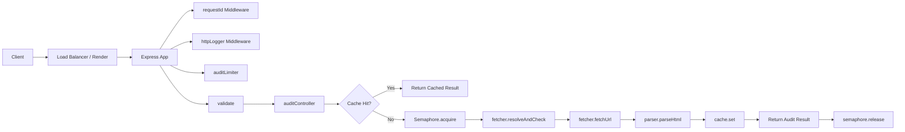

# PagePulse Architecture Document

## 1. Components

### 1.1 Client Layer
- **Web clients / API consumers** send `POST /api/audit` with a target URL and optional timeout/maxRedirects.
- Clients receive a structured JSON response with audit data, requestId, and timestamp.

### 1.2 API Gateway / Load Balancer
- **Render Load Balancer** (or equivalent) terminates TLS and distributes traffic across app instances.
- Provides DDoS protection and basic health checking.

### 1.3 Application Layer (Stateless Workers)
- **Express app** (`src/app.js`) mounted behind the load balancer.
- Processes requests through middleware pipeline:
  - `helmet` — security headers
  - `cors` — CORS policy
  - `express.json` — body parsing
  - `requestId` — UUID injection
  - `httpLogger` — Pino structured logging
  - `auditLimiter` — rate limiting per client IP
  - `validate(auditValidator)` — input validation + SSRF check
- Delegates to `auditController` → `auditService`.

### 1.4 Service Layer
- **`auditService.js`** — orchestrates fetch, parse, cache; enforces concurrency semaphore.
- **`fetcher.js`** — Axios-based fetcher with AbortController timeout, DNS-based SSRF protection.
- **`parser.js`** — Cheerio HTML parser extracting meta tags, headings, assets.
- **`cache.js`** — NodeCache in-memory cache with SHA-256 normalized keys.
- **`rateLimiter.js`** — express-rate-limit with sliding window.

### 1.5 Data Stores
- **In-memory cache (NodeCache)** — primary cache; LRU eviction; TTL configurable via `CACHE_TTL`.
- **No persistent database** — current implementation is cache-only. For 10K/day scale, cache is sufficient because audits are idempotent and repeat audits are the cache sweet spot.

### 1.6 Observability Stack
- **Pino** — structured JSON logs.
- **Render Metrics** — CPU, memory, request rate, response time from the hosting layer.
- **Custom `/api/cache/stats`** — cache hit/miss/keys/vsize.

---

## 2. Data Flow



### Flow Details
1. **Request arrives** → Express parses JSON body.
2. **requestId** generated and attached to `req.locals.requestId`.
3. **Rate limiter** checks sliding window per client IP.
4. **Validator** checks URL format, length, protocol, and performs live DNS lookup to reject private IPs.
5. **auditController** calls `auditUrl`.
6. **auditService** checks cache:
   - **Hit** → returns cached data immediately with `cached: true`.
   - **Miss** → acquires semaphore slot (max 5 concurrent fetches).
7. **Fetcher** resolves hostname to IPv4, validates it's not private, then performs HTTP GET with configured timeout and redirect limit.
8. **Parser** extracts structured data from HTML.
9. **Cache** stores result with TTL.
10. **Response** returned with `success: true`, `data`, `requestId`, `timestamp`.

---

## 3. Queueing Strategy

### 3.1 Request-Level Queueing
- **Rate limiter** acts as a rejection-based queue: clients exceeding `RATE_LIMIT_MAX` per window receive `429 Too Many Requests` with `retryAfter`.
- No request is held in queue; excess requests fail fast.

### 3.2 Fetch-Level Queueing
- **Semaphore** limits concurrent outbound fetches to `MAX_CONCURRENT_FETCHES` (default 5).
- If all semaphore slots are occupied, the request waits in the semaphore's internal FIFO queue.
- **Overall timeout**: enforced via `Promise.race` between semaphore acquisition and `FETCH_TIMEOUT_MS` (default 10s).
- If timeout fires first, the request fails with `FetchError('Audit timeout')` and returns 502.

### 3.3 Scale Considerations for 10K/day / 500 burst
- Current semaphore is in-process; works for single-instance deployments.
- For multi-instance (e.g., 10 pods), aggregate concurrency = `MAX_CONCURRENT_FETCHES × pods`. With 5 fetches × 10 pods = 50 concurrent outbound requests, which is within typical upstream limits.
- If 500-burst concurrency is required across all instances, distribute via a **shared token bucket** in Redis or use a **message queue** (e.g., BullMQ) to serialize fetches through a worker pool.

---

## 4. State Management

| State | Location | Rationale |
|-------|----------|-----------|
| **Cache entries** | In-memory (NodeCache) per instance | Fast, TTL-based eviction; no cross-instance coordination needed because cache misses are safe. |
| **Rate limit counters** | In-memory (express-rate-limit MemoryStore) | Works for single instance; for multi-instance, switch to Redis store. |
| **Request IDs** | Generated per request, passed through middleware | Stateless; no persistence required. |
| **Semaphore counters** | In-process memory | Works for single instance; for multi-instance, use distributed semaphore (Redis lock). |
| **Audit results** | Ephemeral; not persisted | No DB required; cache is the only persistence layer. |

### State Diagram
```
+-------------------+       +-------------------+
|   Client Request  | ----> |  Express App      |
+-------------------+       +-------------------+
                                   |
                                   v
                         +-------------------+
                         |  In-Memory Cache  |<--- TTL Eviction
                         +-------------------+
                                   |
                         Cache Hit?  |
                         /           \
                    Yes /             \ No
                       /               \
                      v                 v
            +----------------+   +-------------------+
            | Return Cached |   | Semaphore (in-proc)|
            +----------------+   +-------------------+
                                           |
                                           v
                                 +-------------------+
                                 |  fetcher + parser  |
                                 +-------------------+
                                           |
                                           v
                                 +-------------------+
                                 |  Write to Cache   |
                                 +-------------------+
```
